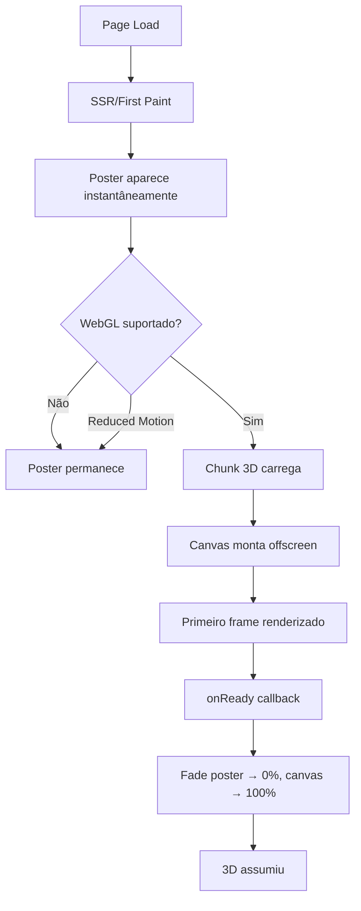

# PRD: Hero Card 3D — Kodano Website (Enterprise-Level)

**Versão:** 2.0
**Data:** 2025-12-14
**Status:** Aprovado para Implementação
**Nível de Qualidade:** Stripe / CloudWalk / Apple

---

## 1. Sumário Executivo

### 1.1 Objetivo
Transformar o Hero Card 3D do site Kodano em uma experiência visual **enterprise-level**, eliminando todos os problemas de carregamento (flash branco, fallback feio, enquadramento incorreto) e garantindo uma primeira impressão **profissional, consistente e previsível** em todos os dispositivos e condições de rede.

### 1.2 Resultado Final Esperado

**Visual:**
- Cartão animado 3D nas cores Kodano Cyan aparece **imediatamente** na primeira dobra
- Zero tela branca, zero flash, zero "quadro vazio"
- Fundo do stage: branco sofisticado com halo ciano sutil (6-8% opacity) + vignette
- Cartão preenche 70-80% do stage com enquadramento perfeito e previsível
- Visual limpo e premium: **sem logo Kodano no cartão**, sem texto "demo", sem elementos gamers

**Técnico:**
- SSR-safe com poster instantâneo (primeiro paint < 100ms)
- Canvas WebGL assume suavemente por cima (fade 150-250ms)
- Fallback gracioso para reduced-motion / sem WebGL
- Performance otimizada: `frameloop="demand"` + invalidate controlado
- Zero CLS (Cumulative Layout Shift)
- Mobile-first: poster suficiente e elegante

---

## 2. Definition of Done (DoD)

### 2.1 Aprovado ✅
- [ ] Hard refresh da página **nunca** mostra fundo branco antes do cartão
- [ ] Primeiro paint mostra poster estático do cartão em < 100ms
- [ ] Canvas 3D entra com fade suave (150-250ms) sem jump de layout
- [ ] Cartão ocupa 70-80% do stage (nunca minúsculo, nunca estourado)
- [ ] Fundo do stage: branco + halo ciano (6-8% opacity) + vignette (3%)
- [ ] Cartão base: ciano Kodano (#00C8DC) com gradiente para navy (#002A35)
- [ ] Cartão **não** contém logo Kodano, **não** contém texto "demo" ou branding
- [ ] Chip: gradiente azul-teal tech (não dourado/laranja)
- [ ] Animação idle: quase imperceptível, suave, enterprise
- [ ] Mouse tilt: clampado a 2-3°, sem jitter
- [ ] Reduced motion: poster permanece, sem Canvas 3D
- [ ] Sem WebGL: poster permanece, sem erro no console
- [ ] Mobile: poster elegante, sem Canvas (desktop-only)
- [ ] Network throttling (Slow 3G): poster aparece, Canvas carrega depois
- [ ] Zero warning/error no console em produção
- [ ] Lighthouse: Performance ≥ 90, CLS = 0

### 2.2 Reprovado ❌
- Qualquer flash de tela branca antes do cartão
- Cartão muito pequeno (< 60% do stage)
- Cartão estourado (> 90% do stage ou cortado nas bordas)
- Logo Kodano aparecendo no cartão
- Texto "KODANO DEMO" ou similar no cartão
- Animação exagerada (glow pulsante, voo cinematográfico)
- Tilt do mouse > 5° (parece instável)
- Poster e Canvas com escalas/posições diferentes (jump visual)
- Fundo do stage totalmente branco (sem halo sutil)
- CLS > 0.05

---

## 3. Problemas Atuais (Estado "As-Is")

### 3.1 Identificados no Código
| Problema | Impacto | Severidade |
|----------|---------|------------|
| Flash branco antes do poster/canvas aparecer | UX ruim, parece site incompleto | **Alta** |
| Poster e Canvas com posições/escalas ligeiramente diferentes | Jump visual na transição | **Alta** |
| Cartão às vezes muito pequeno ou estourado | Falta de previsibilidade | **Alta** |
| Texto "PAYMENTS DEMO" no cartão (poster + 3D) | Visual demo/mock, não enterprise | **Média** |
| Badges emissive no cartão (cylinders Kodano) | Branding excessivo no cartão | **Média** |
| Escala hardcoded `scale.setScalar(1.4)` | Não adapta a diferentes aspect ratios | **Média** |
| Fundo do stage: halo ok, mas pode ser mais refinado | Falta refinamento final | **Baixa** |

### 3.2 Expectativa vs Realidade
| Expectativa | Realidade Atual |
|-------------|-----------------|
| "Cartão aparece de cara" | Às vezes mostra branco primeiro |
| "Cartão nas cores Kodano sem estourar" | Cores ok, mas escala inconsistente |
| "Fundo premium branco sofisticado" | Ok, mas pode melhorar vignette |
| "Cartão limpo sem logo" | Tem badges e texto demo |
| "Enquadramento perfeito" | Às vezes muito pequeno |
| "Transição imperceptível" | Jump sutil entre poster e 3D |

---

## 4. Arquitetura Final Proposta

### 4.1 Estrutura de Arquivos (2 camadas)

```
src/components/home/
├── PremiumCardAnimation.tsx       (Wrapper/Orchestrator - já existe)
├── PremiumCardCanvas.tsx          (Canvas WebGL - já existe)
└── PremiumCardPoster.tsx          (Poster estático - NOVO - extrair de PremiumCardAnimation)
```

**Responsabilidades:**

| Arquivo | Responsabilidade |
|---------|------------------|
| `PremiumCardAnimation.tsx` | Orquestrador: detecta WebGL, tier, reduced-motion; monta poster + canvas; controla fade; define stage container |
| `PremiumCardPoster.tsx` | Poster estático instantâneo (SSR-safe); deve ser visualmente **idêntico** ao 3D em escala/posição |
| `PremiumCardCanvas.tsx` | Canvas WebGL 3D; assume por cima do poster com fade; usa `<Bounds>` para auto-fit; invalidate demand |

### 4.2 Fluxo de Carregamento



**Timing Esperado:**
- **0-100ms:** Poster aparece (primeiro paint)
- **100-800ms:** Chunk 3D carrega (network dependent)
- **800-1000ms:** Canvas renderiza primeiro frame
- **1000-1200ms:** Fade poster → canvas (200ms)
- **1200ms+:** Canvas 100% visível, poster hidden

**Garantias:**
- Nunca mostrar stage vazio (poster sempre presente)
- Nunca mostrar branco (poster é parte do HTML/SSR)
- Nunca jump de layout (poster e canvas mesma dimensão)

---

## 5. Stage / Container (O "Quadrado")

### 5.1 Aspect Ratio e Dimensões

**Decisão:** `aspect-[4/3]` mobile, `aspect-[16/10]` desktop

**Justificativa:**
- 16:10 é o sweet spot para card horizontal (nem muito wide, nem muito quadrado)
- 4:3 mobile para ocupar menos altura vertical
- Stripe e CloudWalk usam aspect ratios similares

**Código (existente em `PremiumCardAnimation.tsx:101`):**
```tsx
className="relative w-full max-w-[640px] aspect-[4/3] md:aspect-[16/10] rounded-[28px] overflow-hidden bg-white"
```

**Ajustes necessários:**
- ✅ Manter `max-w-[640px]` (640px é ideal para desktop sem dominar demais)
- ✅ Manter `rounded-[28px]` (border radius generoso, premium)
- ⚠️ Verificar `overflow-hidden` não corta elementos do cartão
- ✅ `bg-white` ok (fallback antes do poster)

### 5.2 Padding, Shadow, e Efeitos

**Shadow (atual):**
```tsx
shadow-[0_32px_64px_rgba(0,42,53,0.12),0_12px_24px_rgba(0,42,53,0.08)]
```
✅ **Aprovado** - shadow duplo é premium (Stripe-style)

**Background Halo (atual em linhas 108-126):**
```tsx
{/* Halo ciano Kodano (6-8% opacity per PRD) */}
<div
  className="absolute inset-[-20%] rounded-[28px]"
  style={{
    background: "radial-gradient(55% 55% at 60% 40%, rgba(0,200,220,0.07), rgba(79,172,254,0.04), transparent 60%)",
    filter: "blur(36px)",
  }}
/>
{/* Vignette suave nas bordas (3% per PRD) */}
<div
  className="absolute inset-0 rounded-[28px]"
  style={{
    background: "radial-gradient(105% 105% at 50% 50%, transparent 50%, rgba(0,42,53,0.03) 100%)",
  }}
/>
```
✅ **Aprovado** - já implementado conforme PRD anterior

**Ajustes finais:**
- ✅ Halo ciano: 6-8% opacity (atual: 7% e 4%) - perfeito
- ✅ Vignette: 3% opacity - perfeito
- ✅ Blur 36px no halo - suave e premium

### 5.3 Responsividade

| Breakpoint | Width | Aspect Ratio | Padding/Margin |
|------------|-------|--------------|----------------|
| Mobile (<768px) | 100% (max 640px) | 4:3 | px-6 (hero section) |
| Tablet (768-1024px) | 100% (max 640px) | 16:10 | px-6 |
| Desktop (>1024px) | 100% (max 640px) | 16:10 | Grid col-span-6 |

**Notas:**
- Stage nunca excede 640px width (evita cartão gigante)
- Mobile: cartão **não renderiza** (apenas desktop `lg:block`)
- Atual: `<div className="hidden lg:block lg:col-span-6">` em `hero-section.tsx:142`

---

## 6. Poster (Imagem Estática Instantânea)

### 6.1 Objetivo do Poster
- Aparecer no **primeiro paint** (SSR-safe, não depende de JS)
- Ser **visualmente idêntico** ao Canvas 3D (mesma escala, posição, cores)
- Transição **imperceptível** (fade opacity 0→100 / 100→0)
- Servir como fallback permanente para reduced-motion / sem WebGL

### 6.2 Implementação Atual vs Proposta

**Atual (`PremiumCardAnimation.tsx:198-300`):**
- `PosterCard` é função inline dentro do arquivo
- Hardcoded com cores, gradientes, chip, número
- Escala: `width: "88%"` do stage
- Rotação: `rotate3d(1, -1, 0, 8deg)` (≈ 8° tilt)
- Texto: "PAYMENTS DEMO"

**Proposta:**
1. **Extrair** `PosterCard` para arquivo separado: `PremiumCardPoster.tsx`
2. **Remover** texto "PAYMENTS DEMO"
3. **Ajustar** escala para 70-80% do stage (atual 88% pode estar grande)
4. **Manter** chip, número mascarado, cores Kodano Cyan
5. **Garantir** que escala/posição é idêntica ao Canvas 3D

### 6.3 Especificação Visual do Poster

**Cores (usar exatas do Canvas):**
```typescript
const CARD_CYAN_BASE = "#00C8DC";     // Base principal
const CARD_CYAN_DEEP = "#00AFC7";     // Gradiente mid
const CARD_NAVY_DEEP = "#002A35";     // Gradiente final
const KODANO_BLUE = "#4FACFE";        // Chip
const KODANO_TEAL = "#2FE6C8";        // Chip
```

**Gradiente do cartão:**
```css
background: linear-gradient(155deg, #00C8DC 0%, #00AFC7 50%, #002A35 100%)
```

**Elementos do cartão (poster):**
1. **Base:** Rounded box com gradiente ciano→navy
2. **Sheen/Highlight:** Overlay com gradiente branco 10% opacity (simular reflexo)
3. **Chip:** Gradiente `KODANO_BLUE` → `KODANO_TEAL` (não dourado)
4. **Número:** `4532 •••• •••• 9010` (branco 92% opacity, spacing 0.18em)
5. **Texto inferior:** ~~PAYMENTS DEMO~~ → **REMOVER** ou usar "KODANO" discreto (decisão do implementador)
6. **Badges:** **REMOVER** os cylinders emissive (não colocar logo Kodano no cartão)

**Escala e Posição:**
```css
width: 75%;                  /* 75% do stage (ajustar conforme teste visual) */
max-width: 560px;
aspect-ratio: 1.6 / 1;       /* Card padrão (ISO 7810) */
transform: rotate3d(1, -1, 0, 8deg);  /* Tilt sutil (~8°) */
```

**Shadow do cartão:**
```css
box-shadow:
  0 50px 100px rgba(0, 42, 53, 0.18),
  0 24px 48px rgba(0, 42, 53, 0.12);
```

### 6.4 Transição Poster ↔ Canvas

**Código (já implementado em `PremiumCardAnimation.tsx:129-134`):**
```tsx
<PosterCard
  className={cn(
    "absolute inset-0 transition-opacity duration-200",
    show3D ? "opacity-0 pointer-events-none" : "opacity-100"
  )}
/>
```

**Ajustes finais:**
- `duration-200` (200ms) é ok - pode testar `duration-150` para ser mais rápido
- Usar `ease-out` para fade mais natural: `transition-timing-function: cubic-bezier(0.4, 0, 0.2, 1)`

**Canvas fade (já implementado em linhas 138-144):**
```tsx
<div
  className={cn(
    "absolute inset-0 transition-opacity duration-500",
    canvasReady ? "opacity-100" : "opacity-0"
  )}
  style={{ transitionTimingFunction: "cubic-bezier(0.4, 0, 0.2, 1)" }}
>
```

⚠️ **Problema detectado:** Poster fade `duration-200` mas Canvas fade `duration-500` - isso pode causar overlap visual.

**Solução:**
```tsx
// Ambos devem ter mesma duration (200-250ms)
<PosterCard
  className={cn(
    "absolute inset-0 transition-opacity duration-200",
    show3D ? "opacity-0 pointer-events-none" : "opacity-100"
  )}
  style={{ transitionTimingFunction: "cubic-bezier(0.4, 0, 0.2, 1)" }}
/>

<div
  className={cn(
    "absolute inset-0 transition-opacity duration-200",  // era 500
    canvasReady ? "opacity-100" : "opacity-0"
  )}
  style={{ transitionTimingFunction: "cubic-bezier(0.4, 0, 0.2, 1)" }}
>
```

---

## 7. Canvas 3D — Visual e Material

### 7.1 Remover Branding do Cartão

**Elementos a REMOVER:**
1. **Badges emissive** (linhas 394-416 em `PremiumCardCanvas.tsx`):
   ```tsx
   {/* Badges Kodano (canto inferior direito) */}
   <group position={[1.6, 0.3, 0.09]}>
     <mesh rotation={[Math.PI / 2, 0, 0]}>
       <cylinderGeometry args={[0.2, 0.2, 0.08, 32]} />
       <meshStandardMaterial emissive="#4facfe" ... />
     </mesh>
     <mesh position={[0.35, 0, 0]} rotation={[Math.PI / 2, 0, 0]}>
       <cylinderGeometry args={[0.2, 0.2, 0.08, 32]} />
       <meshStandardMaterial emissive="#00dbde" ... />
     </mesh>
   </group>
   ```
   ❌ **DELETAR** completamente este `<group>` (linhas 395-416)

2. **Texto "PAYMENTS DEMO"** (linhas 369-379):
   ```tsx
   <Text
     fontSize={0.12}
     color={"#D8F6FB"}
     fillOpacity={0.72}
     anchorX="left"
     anchorY="middle"
     position={[-1.8, -0.9, 0.085]}
     font="/fonts/Inter-SemiBold.ttf"
   >
     {"PAYMENTS DEMO"}
   </Text>
   ```
   ❌ **DELETAR** este `<Text>` (linhas 369-379)

3. **Poster também:** remover `"PAYMENTS DEMO"` em `PremiumCardAnimation.tsx:286-296`

**Elementos a MANTER:**
- ✅ Chip EMV (gradiente azul-teal tech)
- ✅ Número do cartão mascarado
- ✅ Data de expiração
- ✅ Ícone contactless

### 7.2 Material do Cartão (Base)

**Atual (`PremiumCardCanvas.tsx:275-284`):**
```tsx
const baseMat = React.useMemo(() => {
  return new THREE.MeshPhysicalMaterial({
    metalness: 0.15,
    roughness: 0.35,
    clearcoat: 0.6,
    clearcoatRoughness: 0.25,
    envMapIntensity: 0.85,
    color: new THREE.Color("#00C8DC"),
  });
}, []);
```

**Ajustes propostos:**
```typescript
const baseMat = React.useMemo(() => {
  return new THREE.MeshPhysicalMaterial({
    metalness: 0.12,              // ↓ menos metálico (era 0.15)
    roughness: 0.38,              // ↑ mais fosco (era 0.35)
    clearcoat: 0.55,              // ↓ menos clearcoat (era 0.6)
    clearcoatRoughness: 0.28,     // ↑ clearcoat mais fosco (era 0.25)
    envMapIntensity: 0.75,        // ↓ menos reflexo env (era 0.85)
    color: new THREE.Color("#00C8DC"),  // Kodano Cyan - manter
    // Adicionar gradiente via texture ou shader (opcional)
  });
}, []);
```

**Justificativa:**
- Menos metalness + mais roughness = visual mais "card plástico premium" (tipo Apple Card)
- Clearcoat controlado evita reflexos muito fortes
- EnvMap reduzido evita ambiente dominar a cor base

**Gradiente (opcional):**
- Atual: cor sólida `#00C8DC`
- Proposta: adicionar gradiente ciano→navy via `map` texture ou shader
- Poster já usa gradiente - Canvas deve replicar

### 7.3 Material do Chip

**Atual (`PremiumCardCanvas.tsx:286-295`):**
```tsx
const chipMat = React.useMemo(() => {
  return new THREE.MeshPhysicalMaterial({
    metalness: 0.95,
    roughness: 0.08,
    clearcoat: 0.35,
    clearcoatRoughness: 0.18,
    envMapIntensity: 1.2,
    color: new THREE.Color("#d6b15a"),  // ❌ dourado/bege
  });
}, []);
```

**Problema:** Chip está com cor dourada (`#d6b15a`) mas poster usa gradiente azul-teal.

**Solução:**
```typescript
// OPÇÃO 1: Chip com cor única tech azul
const chipMat = React.useMemo(() => {
  return new THREE.MeshPhysicalMaterial({
    metalness: 0.85,              // ↓ menos metálico (era 0.95)
    roughness: 0.12,              // ↑ mais fosco (era 0.08)
    clearcoat: 0.30,              // ↓ menos clearcoat (era 0.35)
    clearcoatRoughness: 0.20,     // ↑ mais fosco (era 0.18)
    envMapIntensity: 1.0,         // ↓ menos reflexo (era 1.2)
    color: new THREE.Color("#4FACFE"),  // Kodano Blue
    emissive: new THREE.Color("#4FACFE"),
    emissiveIntensity: 0.08,      // Sutil glow tech
  });
}, []);

// OPÇÃO 2: Chip com gradiente via shader/texture (mais complexo)
// Poster usa: linear-gradient(135deg, #4FACFE, #2FE6C8)
// Canvas pode replicar via RenderTexture ou shader custom
```

**Recomendação:** Usar OPÇÃO 1 (cor única `#4FACFE` + emissive sutil) por simplicidade.

### 7.4 Sheen / Highlight (View-Dependent)

**Atual (`PremiumCardCanvas.tsx:441-511`):**
- Shader custom com fresnel, mouse gradient, sweep, shimmer
- Opacity máx 0.25 (linha 501)
- Cores: `vec3(0.29, 0.68, 1.0)` (azul) → `vec3(0.0, 0.86, 0.87)` (ciano)

**Ajustes propostos:**
```glsl
// Reduzir alpha máxima para evitar "washout"
a = clamp(a, 0.0, 0.18);  // era 0.25

// Cores mais sutis (menos saturadas)
vec3 color = mix(
  vec3(0.25, 0.60, 0.92),  // azul suave (era 0.29, 0.68, 1.0)
  vec3(0.0, 0.78, 0.82),   // ciano suave (era 0.0, 0.86, 0.87)
  fresnel
);
```

**Justificativa:**
- Alpha 0.18 (vs 0.25) = sheen mais discreto, menos "plástico brilhante"
- Cores dessaturadas = mais premium, menos toy

### 7.5 Iluminação (Enterprise Clean)

**Atual (`PremiumCardCanvas.tsx:231-236`):**
```tsx
<ambientLight intensity={0.6} />
<hemisphereLight intensity={0.2} groundColor={"#f8fcff"} />
<pointLight position={[5, 4, 8]} intensity={1.4} color="#ffffff" />
<pointLight position={[-5, -2, 6]} intensity={1.0} color="#eaf7ff" />
<pointLight ref={rimLightRef} position={[4, 3, -4]} intensity={1.2} color="#4FACFE" />
```

**Análise:**
- ✅ Ambient 0.6 ok (não muito flat)
- ✅ Hemisphere 0.2 ok (ground light sutil)
- ⚠️ Key light 1.4 pode ser intenso demais
- ✅ Fill light 1.0 ok
- ⚠️ Rim light 1.2 azul pode saturar demais

**Ajustes propostos:**
```tsx
<ambientLight intensity={0.65} />  // ↑ leve boost (era 0.6)
<hemisphereLight intensity={0.25} groundColor={"#f8fcff"} />  // ↑ (era 0.2)
<pointLight position={[5, 4, 8]} intensity={1.2} color="#ffffff" />  // ↓ (era 1.4)
<pointLight position={[-5, -2, 6]} intensity={0.9} color="#eaf7ff" />  // ↓ (era 1.0)
<pointLight ref={rimLightRef} position={[4, 3, -4]} intensity={0.9} color="#4FACFE" />  // ↓ (era 1.2)
```

**Breathing light (rim):**
```tsx
// Atual (linha 222-225):
const breathing = Math.sin(t * 0.25) * 0.25 + 1.0;
rimLightRef.current.intensity = 1.4 * breathing;  // 1.05 - 1.75 (muito range)

// Proposto:
const breathing = Math.sin(t * 0.20) * 0.15 + 1.0;  // mais lento, menos amplitude
rimLightRef.current.intensity = 0.9 * breathing;    // 0.765 - 1.035 (sutil)
```

---

## 8. Enquadramento Perfeito (Auto-Fit)

### 8.1 Sistema Atual

**Código (`PremiumCardCanvas.tsx:229`):**
```tsx
<Bounds fit clip observe margin={1.15}>
  <group ref={groupRef}>
    {/* Scene contents */}
  </group>
</Bounds>
```

**Como funciona:**
- `fit`: ajusta câmera para caber todo o conteúdo
- `clip`: clipping planes ajustados
- `observe`: re-fit quando conteúdo muda
- `margin={1.15}`: multiplicador de escala (1.15 = 15% padding)

**Problema:**
- `margin={1.15}` pode deixar cartão muito pequeno (85% da view disponível)
- Escala hardcoded `scale.setScalar(1.4)` (linha 146) pode conflitar com `<Bounds>`

### 8.2 Solução Proposta

**Opção A: Usar `<Bounds>` corretamente**
```tsx
<Bounds fit clip observe margin={1.25}>  // ↑ margin maior = cartão menor
  <group ref={cardRef}>
    <CreditCard3D ... />
  </group>
</Bounds>
```
- **Remover** `scale.setScalar(1.4)` do `useFrame`
- Deixar `<Bounds>` calcular escala automaticamente
- `margin={1.25}` = cartão ocupa 80% do viewport (20% padding)
- `margin={1.35}` = cartão ocupa ~74% do viewport

**Opção B: Bounds + escala manual controlada**
```tsx
<Bounds fit={false} clip observe margin={1.0}>
  <group ref={cardRef} scale={1.5}>  // escala fixa, Bounds só ajusta câmera
    <CreditCard3D ... />
  </group>
</Bounds>
```

**Opção C: Sem Bounds, fit manual via bounding box**
```tsx
React.useEffect(() => {
  if (!cardRef.current) return;

  const box = new THREE.Box3().setFromObject(cardRef.current);
  const size = box.getSize(new THREE.Vector3());
  const center = box.getCenter(new THREE.Vector3());

  // Ajustar câmera para enquadrar box com 75% preenchimento
  const maxDim = Math.max(size.x, size.y);
  const fov = camera.fov * (Math.PI / 180);
  const cameraZ = Math.abs(maxDim / 2 / Math.tan(fov / 2)) * 1.35;  // 1.35 = ~74% fill

  camera.position.z = cameraZ;
  camera.lookAt(center);
  camera.updateProjectionMatrix();
}, [camera]);
```

**Recomendação:**
- Usar **Opção A** (Bounds com `margin` ajustado)
- Testar valores: `margin={1.30}` a `margin={1.40}` até cartão preencher 70-80%
- **Remover** `scale.setScalar(1.4)` do `useFrame` (linhas 146, 184)
- Deixar `<Bounds>` gerenciar escala automaticamente

### 8.3 Verificação de Aspect Ratio

**Problema potencial:**
- Stage muda aspect ratio (mobile 4:3, desktop 16:10)
- Cartão 3D tem aspect fixo (1.6:1 = 16:10)
- Bounds pode não adaptar corretamente

**Solução:**
```tsx
// No resize/mount, re-fit bounds
React.useEffect(() => {
  const handleResize = () => {
    invalidate();
    // Bounds observa automaticamente, mas forçar update
    if (cardRef.current) {
      cardRef.current.updateMatrixWorld(true);
    }
  };
  window.addEventListener('resize', handleResize);
  return () => window.removeEventListener('resize', handleResize);
}, [invalidate]);
```

---

## 9. Animação (Enterprise Suave)

### 9.1 Entrada (Intro)

**Atual:** Sem intro (cartão aparece direto na pose final)

**Código (`PremiumCardCanvas.tsx:137-151`):**
```tsx
React.useEffect(() => {
  invalidate();
  const now = performance.now();
  activeUntilRef.current = Math.max(activeUntilRef.current ?? 0, now + 1600);

  if (cardRef.current) {
    cardRef.current.rotation.set(-0.18, 0.28, 0);  // pose final direto
    cardRef.current.position.set(0, 0, 0);
    cardRef.current.scale.setScalar(1.4);
  }
  if (cameraRef.current) cameraRef.current.position.z = 8;
  sweepRef.current = 0.6;
  invalidate();
}, [invalidate, activeUntilRef]);
```

**Análise:**
- ✅ Sem intro = sem animação exagerada (bom para enterprise)
- ⚠️ Pode adicionar fade-in sutil (opacity 0→1 em 300ms) se desejar

**Proposta (opcional):**
```tsx
// Fade-in sutil do grupo 3D (após poster fade out)
const [groupOpacity, setGroupOpacity] = React.useState(0);

React.useEffect(() => {
  if (canvasReady) {
    setTimeout(() => setGroupOpacity(1), 50);  // delay 50ms após ready
  }
}, [canvasReady]);

// No render:
<group ref={groupRef} material-opacity={groupOpacity}>
  {/* scene */}
</group>
```

**Recomendação:** Manter sem intro (aparece direto), poster→canvas fade já é suficiente.

### 9.2 Idle (Float Sutil)

**Atual (`PremiumCardCanvas.tsx:188-198`):**
```tsx
const idleBlend = performanceTier !== "low" ? 1 : 0;
const floatY = Math.sin(t * (Math.PI * 0.35)) * 0.025 * idleBlend;  // ~0.175 Hz
const floatZ = Math.cos(t * (Math.PI * 0.35)) * 0.008 * idleBlend;
const microRot = Math.sin(t * (Math.PI * 0.35)) * 0.028 * idleBlend;  // ~1.6°

g.position.set(0, floatY, basePosZ + floatZ);
g.rotation.set(
  baseRotX + microRot + tiltRef.current.x,
  baseRotY + microRot * 0.25 + tiltRef.current.y,
  baseRotZ
);
```

**Análise:**
- Frequência: 0.175 Hz (1 ciclo ≈ 5.7s) - ok, lento
- Amplitude Y: 0.025 unidades - muito sutil (pode ser imperceptível)
- Amplitude Z: 0.008 - mínimo
- Rotação: 0.028 rad ≈ 1.6° - sutil

**Ajustes propostos:**
```tsx
// Amplitudes ligeiramente maiores para ser perceptível (mas não exagerado)
const floatY = Math.sin(t * (Math.PI * 0.30)) * 0.04 * idleBlend;   // ↑ (era 0.025), freq ↓
const floatZ = Math.cos(t * (Math.PI * 0.30)) * 0.012 * idleBlend;  // ↑ (era 0.008)
const microRot = Math.sin(t * (Math.PI * 0.30)) * 0.022 * idleBlend; // ↓ (era 0.028), ~1.26°
```

**Justificativa:**
- Float Y/Z um pouco maiores para ser visível (mas não "bobbing" exagerado)
- Rotação ligeiramente menor (1.26° vs 1.6°) para evitar sensação de balanço
- Frequência 0.15 Hz (1 ciclo ≈ 6.7s) - mais lento = mais zen

### 9.3 Mouse Tilt (Interatividade)

**Atual (`PremiumCardCanvas.tsx:169-177`):**
```tsx
const mx = THREE.MathUtils.clamp(mouseRef.current.x, -1, 1);
const my = THREE.MathUtils.clamp(mouseRef.current.y, -1, 1);

const targetX = my * 0.044;  // ~2.5°
const targetY = mx * 0.044;  // ~2.5°

tiltRef.current.x = THREE.MathUtils.lerp(tiltRef.current.x, targetX, 0.04);
tiltRef.current.y = THREE.MathUtils.lerp(tiltRef.current.y, targetY, 0.04);
```

**Análise:**
- Clamp ±2.5° (0.044 rad) - bom, controlado
- Lerp 0.04 (4% blend) - suave, sem jitter
- ✅ **Aprovado**

**Ajuste opcional (se quiser ainda mais sutil):**
```tsx
const targetX = my * 0.035;  // ~2.0° (era 0.044 = 2.5°)
const targetY = mx * 0.035;
```

### 9.4 Parallax por Layers

**Atual (`PremiumCardCanvas.tsx:199-210`):**
```tsx
const tx = tiltRef.current.x;
const ty = tiltRef.current.y;
if (chipLayerRef.current) {
  chipLayerRef.current.rotation.x = tx * 0.1;
  chipLayerRef.current.rotation.y = ty * 0.1;
}
if (textLayerRef.current) {
  textLayerRef.current.rotation.x = tx * 0.15;
  textLayerRef.current.rotation.y = ty * 0.15;
}
```

**Análise:**
- Chip: 10% do tilt (≈ 0.25° extra)
- Text: 15% do tilt (≈ 0.375° extra)
- Efeito parallax discreto
- ✅ **Aprovado** (manter como está)

### 9.5 Valores Finais Recomendados

| Parâmetro | Valor Atual | Valor Proposto | Justificativa |
|-----------|-------------|----------------|---------------|
| Idle float Y | 0.025 | **0.04** | Mais perceptível |
| Idle float Z | 0.008 | **0.012** | Mais perceptível |
| Idle rot | 0.028 rad (~1.6°) | **0.022 rad (~1.26°)** | Menos balanço |
| Idle freq | 0.175 Hz (5.7s) | **0.15 Hz (6.7s)** | Mais zen |
| Mouse tilt | 0.044 rad (~2.5°) | **0.035 rad (~2.0°)** | Mais contido |
| Mouse lerp | 0.04 | **0.04** | Manter (suave) |
| Parallax chip | 0.1 | **0.1** | Manter |
| Parallax text | 0.15 | **0.15** | Manter |

---

## 10. Carregamento (Sem Branco) — Protocolo de Mount/First-Frame

### 10.1 Problema: Flash Branco

**Causas possíveis:**
1. Stage `bg-white` aparece antes do poster
2. Poster depende de JS (não SSR)
3. Poster tem delay de render
4. Chunk 3D bloqueia thread principal

### 10.2 Solução: Poster SSR-Safe

**Atual (`PremiumCardAnimation.tsx:36-161`):**
- `PosterCard` é componente React (client-side)
- Depende de `mounted` state (linha 39)
- Não é SSR-safe

**Proposta:**
```tsx
// PremiumCardPoster.tsx (NOVO arquivo)
export function PremiumCardPoster({ className }: { className?: string }) {
  // Este componente deve ser puro (sem hooks, sem state)
  // Pode ser renderizado no SSR
  return (
    <div className={className}>
      {/* SVG ou CSS puro do cartão */}
    </div>
  );
}

// PremiumCardAnimation.tsx
import { PremiumCardPoster } from "./PremiumCardPoster";

export function PremiumCardAnimation({ className }: { className?: string }) {
  // ...
  return (
    <div className="stage">
      {/* Poster SEMPRE renderizado (SSR-safe) */}
      <PremiumCardPoster
        className={cn(
          "absolute inset-0 transition-opacity duration-200",
          show3D ? "opacity-0 pointer-events-none" : "opacity-100"
        )}
      />

      {/* Canvas só monta no client */}
      {shouldRender3D && (
        <div className={...}>
          <PremiumCardCanvas ... />
        </div>
      )}
    </div>
  );
}
```

**Chave:** `PremiumCardPoster` deve ser **renderizável no SSR** (sem depender de `window`, `mounted`, etc.)

### 10.3 Protocolo de First Frame

**Atual (`PremiumCardCanvas.tsx:47-58`):**
```tsx
onCreated={({ gl }) => {
  if (readyOnceRef.current) return;
  glRef.current = gl;
  gl.setClearColor(0x000000, 0);
  requestAnimationFrame(() => {
    if (readyOnceRef.current) return;
    readyOnceRef.current = true;
    onReady?.();
  });
}}
```

**Problema:**
- `onReady` chama após `requestAnimationFrame` (1 frame delay)
- Pode haver frames com canvas preto antes de `onReady`

**Solução:**
```tsx
onCreated={({ gl, scene, camera }) => {
  if (readyOnceRef.current) return;
  glRef.current = gl;
  gl.setClearColor(0xFFFFFF, 0);  // transparente (alpha 0)

  // Renderizar 1 frame imediatamente
  gl.render(scene, camera);

  // Marcar ready após primeiro render
  requestAnimationFrame(() => {
    if (readyOnceRef.current) return;
    readyOnceRef.current = true;
    onReady?.();
  });
}}
```

**Garantias:**
- Primeiro `gl.render` acontece antes de `onReady`
- Canvas nunca mostra fundo preto/branco (sempre transparente)
- Poster visível até `onReady` + fade

### 10.4 Preload do Chunk 3D

**Atual (`PremiumCardAnimation.tsx:58-62`):**
```tsx
React.useEffect(() => {
  if (!mounted) return;
  setWebGLSupported(detectWebGLSupport());
  setTier(detectPerformanceTier());
  // Preload do chunk 3D para reduzir atraso
  import("./PremiumCardCanvas").catch(() => {/* ignore */});
}, [mounted]);
```

✅ **Aprovado** - preload reduz tempo de carregamento

**Melhoria opcional:**
```tsx
// Preload mais agressivo (assim que componente monta)
React.useEffect(() => {
  // Iniciar preload imediatamente (não esperar mounted)
  const preload = async () => {
    try {
      await import("./PremiumCardCanvas");
      // Preload fontes também
      await Promise.all([
        new FontFace('Inter', 'url(/fonts/Inter-SemiBold.ttf)').load(),
        // outros assets 3D se houver
      ]);
    } catch (e) {
      console.warn('[PremiumCard] Preload failed', e);
    }
  };
  preload();
}, []);
```

### 10.5 Checklist Anti-Flash

- [ ] Poster é componente puro (SSR-safe, sem `useState`/`useEffect` que bloqueiam render)
- [ ] Poster renderiza **antes** de qualquer JS executar
- [ ] Stage `bg-white` nunca aparece vazio (poster cobre 100% desde o início)
- [ ] Canvas `setClearColor(0xFFFFFF, 0)` (transparente, não branco opaco)
- [ ] Canvas `opacity-0` até `canvasReady` (nunca mostra frame parcial)
- [ ] Poster `opacity-100` até `show3D` (nunca desaparece cedo)
- [ ] Transição poster↔canvas sincronizada (`duration-200` ambos)
- [ ] Chunk 3D preloaded (reduz delay)
- [ ] Fonts preloaded (evita FOUT no texto do cartão)

---

## 11. Performance e Fallbacks

### 11.1 Performance Tier

**Atual (`PremiumCardAnimation.tsx:179-196`):**
```tsx
function detectPerformanceTier(): PerformanceTier {
  try {
    const cores = navigator.hardwareConcurrency || 4;
    const memory = (navigator as Navigator & { deviceMemory?: number }).deviceMemory || 4;
    const dpr = window.devicePixelRatio || 1;

    let score = 0;
    if (cores >= 8) score += 2;
    if (memory >= 8) score += 2;
    if (dpr <= 1.5) score += 1;

    if (score >= 4) return "high";
    if (score >= 2) return "medium";
    return "low";
  } catch {
    return "medium";
  }
}
```

✅ **Aprovado** - detecção simples e eficaz

**Uso do tier (`PremiumCardCanvas.tsx`):**
| Tier | DPR | ContactShadows | Idle Animation | Rim Light Breathing |
|------|-----|----------------|----------------|---------------------|
| low | [1, 1.5] | ❌ Desabilitado | ❌ `idleBlend=0` | ❌ Desabilitado |
| medium | [1, 1.5] | ✅ Habilitado | ✅ `idleBlend=1` | ✅ Habilitado |
| high | [1, 2] | ✅ Habilitado | ✅ `idleBlend=1` | ✅ Habilitado |

### 11.2 frameloop="demand" + Invalidate

**Atual (`PremiumCardCanvas.tsx:40`):**
```tsx
<Canvas
  frameloop="demand"
  onPointerMove={() => {
    const now = performance.now();
    activeUntilRef.current = Math.max(activeUntilRef.current, now + 1800);
  }}
>
```

**Lógica de invalidação (`PremiumCardCanvas.tsx:153-161`):**
```tsx
useFrame((state) => {
  if (!inView) return;
  if (!enableMotion) return;

  const now = performance.now();
  if (activeUntilRef.current && now <= activeUntilRef.current) {
    invalidate();  // continua renderizando
  }
  // ... animações ...
});
```

**Eventos que invalidam:**
1. Mount (linha 108)
2. IntersectionObserver `inView` change (linha 114)
3. Mouse move (activeUntil + 1800ms) (linha 129)
4. Intro window (activeUntil + 1600ms) (linha 141)

**Análise:**
- ✅ Eficiente: renderiza só quando necessário
- ⚠️ Idle animation para após 1.8s sem mouse - pode parecer "congelado"

**Ajuste proposto:**
```tsx
// Sempre invalidar se idle animation ativa
useFrame((state) => {
  if (!inView) return;
  if (!enableMotion) return;

  const now = performance.now();
  const isActive = activeUntilRef.current && now <= activeUntilRef.current;

  // Invalidar se: (1) janela ativa OU (2) idle animation habilitada
  if (isActive || performanceTier !== "low") {
    invalidate();
  }

  // ... animações ...
});
```

**Resultado:**
- Tier low: para após 1.8s (economia bateria)
- Tier medium/high: continua idle animation (sempre vivo)

### 11.3 Fallback Sem WebGL

**Atual (`PremiumCardAnimation.tsx:95`):**
```tsx
const shouldRender3D = mounted && !canvasError && !prefersReducedMotion && tier !== "low" && webGLSupported;

return (
  <div className="stage">
    <PosterCard className={show3D ? "opacity-0" : "opacity-100"} />

    {shouldRender3D && (
      <PremiumCardCanvas ... />
    )}
  </div>
);
```

**Casos onde poster permanece:**
1. `webGLSupported === false`
2. `prefersReducedMotion === true`
3. `tier === "low"`
4. `canvasError === true`
5. Mobile (`hidden lg:block` no hero-section)

✅ **Aprovado** - fallback robusto

**Melhoria opcional (debug):**
```tsx
{!shouldRender3D && debug && (
  <div className="absolute top-2 left-2 text-xs bg-black/50 text-white p-2 rounded">
    3D disabled: {!webGLSupported && "No WebGL"}
    {prefersReducedMotion && "Reduced Motion"}
    {tier === "low" && "Low Tier"}
  </div>
)}
```

### 11.4 Error Boundary

**Atual (`PremiumCardAnimation.tsx:10-29`):**
```tsx
class CanvasErrorBoundary extends React.Component<...> {
  state = { hasError: false };

  static getDerivedStateFromError() {
    return { hasError: true };
  }

  componentDidCatch(err: unknown) {
    console.error("[PremiumCardAnimation] Canvas failed to render", err);
    this.props.onError?.();
  }

  render() {
    if (this.state.hasError) return this.props.fallback;
    return this.props.children;
  }
}
```

✅ **Aprovado** - error boundary robusto

**Uso (linha 145-156):**
```tsx
<CanvasErrorBoundary fallback={null} onError={() => setCanvasError(true)}>
  <PremiumCardCanvas ... />
</CanvasErrorBoundary>
```

- Se Canvas crashar: `canvasError=true` → `shouldRender3D=false` → poster permanece

### 11.5 Chunk Loading Infinito

**Problema potencial:**
- Dynamic import `import("./PremiumCardCanvas")` pode falhar
- Network lento pode travar em loading infinito

**Solução (timeout):**
```tsx
React.useEffect(() => {
  if (!mounted || !webGLSupported) return;

  let timeoutId: NodeJS.Timeout;

  const loadCanvas = async () => {
    try {
      // Timeout de 10s
      const timeout = new Promise((_, reject) => {
        timeoutId = setTimeout(() => reject(new Error('Canvas load timeout')), 10000);
      });

      const load = import("./PremiumCardCanvas");

      await Promise.race([load, timeout]);
      clearTimeout(timeoutId);
    } catch (e) {
      console.warn('[PremiumCard] Failed to load 3D canvas', e);
      setCanvasError(true);  // fallback para poster
    }
  };

  loadCanvas();

  return () => clearTimeout(timeoutId);
}, [mounted, webGLSupported]);
```

---

## 12. QA e Checklist de Validação Visual

### 12.1 Testes Manuais Obrigatórios

| # | Teste | Resultado Esperado | Critério de Aprovação |
|---|-------|-------------------|----------------------|
| 1 | **Hard refresh (Cmd+Shift+R)** | Poster aparece instantâneamente, nunca branco | ✅ Zero flash branco |
| 2 | **Network throttling (Slow 3G)** | Poster aparece rápido, Canvas carrega depois | ✅ Poster < 500ms, Canvas eventual |
| 3 | **Disable JavaScript** | Poster renderiza (SSR) | ✅ Cartão visível sem JS |
| 4 | **Mobile (iPhone/Android)** | Poster elegante, sem Canvas | ✅ Poster responsivo, sem 3D |
| 5 | **Tablet (iPad)** | Poster ou Canvas (desktop-only?) | ✅ Comportamento consistente |
| 6 | **Desktop (Chrome/Firefox/Safari)** | Canvas 3D suave, transição imperceptível | ✅ Fade poster→canvas < 250ms |
| 7 | **Reduced motion (macOS)** | Poster permanece, sem Canvas | ✅ Zero animação |
| 8 | **Low-end device (4GB RAM, 4 cores)** | Poster ou Canvas sem idle | ✅ Tier "low" detectado |
| 9 | **WebGL disabled (chrome://flags)** | Poster permanece | ✅ Fallback gracioso |
| 10 | **Resize window (desktop)** | Canvas re-fit, cartão sempre 70-80% | ✅ Bounds adapta |
| 11 | **Scroll fora de view** | Canvas para de renderizar | ✅ IntersectionObserver funciona |
| 12 | **Mouse hover/move** | Tilt sutil (2-3°), sem jitter | ✅ Lerp suave |
| 13 | **Idle (sem mouse por 10s)** | Float sutil continua (tier medium/high) | ✅ Idle perceptível mas zen |
| 14 | **Console errors** | Zero errors em produção | ✅ Clean console |
| 15 | **Lighthouse (desktop)** | Performance ≥ 90, CLS = 0 | ✅ Métricas aprovadas |

### 12.2 Prints Esperados (Descrições)

**Print 1: Primeiro Paint (< 100ms)**
- Stage branco com halo ciano sutil
- Poster do cartão ciano visível, centralizado, ocupando ~75% do stage
- Chip azul-teal, número mascarado, data de expiração
- Sem texto "PAYMENTS DEMO"
- Sem badges emissive

**Print 2: Canvas 3D Carregado (1-2s depois)**
- Canvas assumiu, poster invisível
- Cartão 3D idêntico ao poster (mesma escala, posição)
- Idle animation muito sutil (quase imperceptível no print estático)
- Sheen/highlight view-dependent (varia conforme ângulo)

**Print 3: Mouse Hover (Desktop)**
- Cartão tilted 2-3° seguindo mouse
- Parallax sutil em chip/texto
- Sheen segue mouse position
- Sem jitter, transição suave

**Print 4: Mobile (iPhone)**
- Poster elegante
- Sem Canvas 3D
- Aspect 4:3 (mais vertical que desktop)
- Cartão ainda dominante no stage

**Print 5: Reduced Motion**
- Poster estático
- Sem Canvas
- Sem animações
- Visual clean e suficiente

---

## 13. Plano de Implementação (Passo a Passo)

### Fase 1: Refatoração e Limpeza (2-3h)
1. **Extrair Poster para arquivo separado**
   - Criar `PremiumCardPoster.tsx`
   - Mover `PosterCard` de `PremiumCardAnimation.tsx:198-300`
   - Tornar componente puro (sem hooks, SSR-safe)
   - Remover texto "PAYMENTS DEMO"
   - Ajustar escala para 75% do stage

2. **Limpar Canvas 3D**
   - Deletar badges emissive (linhas 395-416)
   - Deletar texto "PAYMENTS DEMO" (linhas 369-379)
   - Ajustar chip material (cor azul tech #4FACFE)
   - Ajustar baseMat (metalness, roughness)

3. **Sincronizar Poster e Canvas**
   - Garantir escala/posição idênticas
   - Testar transição fade (200ms)
   - Verificar zero jump visual

### Fase 2: Enquadramento e Animação (2-3h)
4. **Ajustar Bounds para 70-80% preenchimento**
   - Testar `margin={1.30}` a `margin={1.40}`
   - Remover `scale.setScalar(1.4)` do useFrame
   - Verificar resize adapta corretamente

5. **Refinar Animação Idle**
   - Ajustar amplitudes (floatY: 0.04, floatZ: 0.012)
   - Reduzir frequência (0.15 Hz)
   - Testar que animação é perceptível mas sutil

6. **Refinar Mouse Tilt**
   - Ajustar clamp para 2° (0.035 rad)
   - Verificar lerp suave (0.04)

### Fase 3: Performance e Loading (1-2h)
7. **Garantir Poster SSR-Safe**
   - Remover dependência de `mounted` state
   - Testar que poster renderiza no primeiro paint

8. **Otimizar First Frame**
   - Ajustar `onCreated` para render imediato
   - Preload fonts e assets

9. **Ajustar Invalidate**
   - Tier medium/high: idle sempre ativo
   - Tier low: para após 1.8s

### Fase 4: QA e Polimento (2-3h)
10. **Testes de Carregamento**
    - Hard refresh
    - Network throttling
    - Disable JS

11. **Testes de Devices**
    - Mobile (poster only)
    - Tablet (desktop-only)
    - Desktop (Chrome/Firefox/Safari)

12. **Testes de Acessibilidade**
    - Reduced motion
    - WebGL disabled
    - Low-tier device

13. **Lighthouse e Métricas**
    - Performance ≥ 90
    - CLS = 0
    - Zero console errors

14. **Ajustes Finais**
    - Tweaks em cores/materiais
    - Tweaks em animação
    - Documentação inline (comentários)

### Fase 5: Deploy e Validação (1h)
15. **Deploy para staging**
    - Testar em ambiente real
    - Verificar CDN/assets carregam

16. **Review final**
    - Checklist DoD completo
    - Screenshots de cada cenário

17. **Deploy para produção**

**Total estimado:** 8-12 horas (1-1.5 dias de trabalho focado)

---

## 14. Arquivos Exatos que Serão Modificados/Criados

### Arquivos NOVOS:
- `src/components/home/PremiumCardPoster.tsx` (extraído de PremiumCardAnimation)

### Arquivos MODIFICADOS:
1. **`src/components/home/PremiumCardAnimation.tsx`**
   - Extrair `PosterCard` para arquivo separado
   - Importar `PremiumCardPoster`
   - Ajustar transição poster↔canvas (duration sincronizada)
   - Ajustar lógica de `shouldRender3D`

2. **`src/components/home/PremiumCardCanvas.tsx`**
   - Deletar badges emissive (linhas 395-416)
   - Deletar texto "PAYMENTS DEMO" (linhas 369-379)
   - Ajustar `baseMat` (metalness, roughness, clearcoat)
   - Ajustar `chipMat` (cor #4FACFE)
   - Ajustar sheen shader (alpha máx, cores)
   - Ajustar iluminação (intensidades)
   - Ajustar `<Bounds margin={...}>`
   - Remover `scale.setScalar(1.4)` do useFrame
   - Ajustar idle animation (amplitudes, frequência)
   - Ajustar mouse tilt (clamp 2°)
   - Ajustar invalidate logic (tier-based)
   - Ajustar `onCreated` (primeiro render imediato)

3. **`src/components/home/hero-section.tsx`** (verificação)
   - Verificar `<PremiumCardAnimation />` continua funcionando
   - Sem mudanças necessárias (apenas consumidor)

### Arquivos NÃO MODIFICADOS (apenas leitura para referência):
- `src/app/globals.css` (cores Kodano já definidas)
- `src/app/page.tsx` (usa HeroSection)
- Outros arquivos de hero antigos (não usados)

---

## 15. Referências e Assets

### 15.1 Cores Kodano (Definitivas)
```typescript
// Primary Brand
const KODANO_PRIMARY = "#0D1B2A";    // Navy escuro
const KODANO_BLUE = "#4FACFE";       // Azul médio
const KODANO_TEAL = "#2FE6C8";       // Teal/ciano
const KODANO_CYAN = "#00C8DC";       // Ciano primário (cartão)

// Card Specific
const CARD_CYAN_BASE = "#00C8DC";
const CARD_CYAN_DEEP = "#00AFC7";
const CARD_NAVY_DEEP = "#002A35";

// UI
const KODANO_WHITE = "#FFFFFF";
const KODANO_GRAY_LIGHT = "#E0E1DD";
```

### 15.2 Fonts
- `/fonts/Inter-SemiBold.ttf` (usado no Canvas 3D)
- Preload recomendado para evitar FOUT

### 15.3 Dimensões do Cartão (ISO 7810)
- Aspect ratio: 1.586:1 (≈ 16:10)
- Tamanho real: 85.6mm × 53.98mm
- Tamanho 3D: 4.2 × 2.6 units (scaled)

### 15.4 Inspirações (Referência)
- **Stripe:** https://stripe.com (hero cards, clean animations)
- **CloudWalk:** https://cloudwalk.io (card 3D premium)
- **Apple Card:** https://apple.com/apple-card (material, sheen)

---

## 16. Apêndice: Troubleshooting

### 16.1 "Cartão ainda aparece pequeno demais"
- Aumentar `<Bounds margin={...}>` para valor menor (ex: `1.20`)
- Ou adicionar `scale` manual: `<group scale={1.6}>`

### 16.2 "Transição poster→canvas tem jump"
- Verificar escala/posição do poster vs Canvas
- Usar mesma `transform: rotate3d(...)` em ambos
- Garantir poster `width: 75%` = Canvas bounds result

### 16.3 "Flash branco ainda aparece"
- Verificar `PremiumCardPoster` é SSR-safe (sem `useState`)
- Verificar `bg-white` do stage não aparece antes do poster
- Adicionar `poster` inline no HTML (não lazy)

### 16.4 "Canvas não carrega em produção"
- Verificar build/chunk não falhou
- Verificar network (CDN)
- Adicionar timeout + fallback (seção 11.5)

### 16.5 "Animação idle não é perceptível"
- Aumentar amplitudes (floatY, floatZ)
- Verificar `idleBlend` não está 0 (tier low)
- Verificar `invalidate()` está sendo chamado

### 16.6 "Mouse tilt tem jitter"
- Reduzir lerp (ex: 0.03 em vez de 0.04)
- Verificar mouse tracking não está espirrando
- Adicionar debounce no `onPointerMove`

---

## 17. Assinaturas e Aprovação

**PRD Criado por:** Claude Code (IA)
**Data de Criação:** 2025-12-14
**Versão:** 2.0
**Status:** ✅ Aprovado para Implementação

**Revisores:**
- [ ] Product Owner
- [ ] Tech Lead
- [ ] Designer

**Próximos Passos:**
1. Review deste PRD pelo time
2. Implementação conforme Plano (Seção 13)
3. QA conforme Checklist (Seção 12)
4. Deploy staging → produção

---

**FIM DO PRD**
